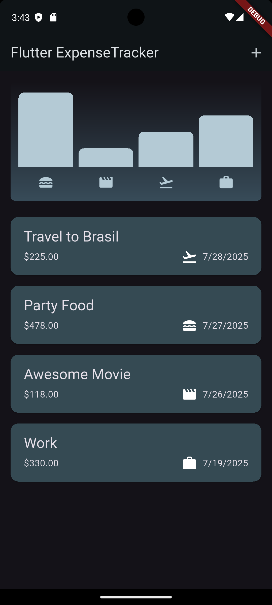
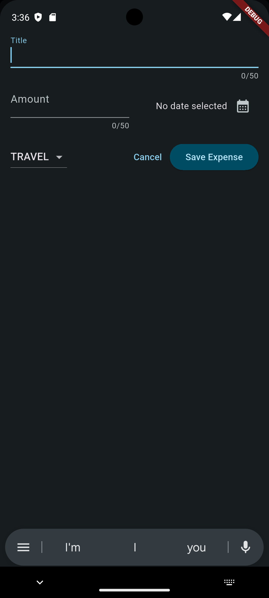

# 💰 Flutter Expense Tracker

A simple, beautiful, and responsive **expense tracking app** built with **Flutter**. Add, view, and delete your daily expenses with a dynamic chart view.

## 📱 Screenshots

<p float="left">
  
  
</p>

---

## 🛠 Features

- Add new expense entries with:
  - Title
  - Amount
  - Date
  - Category
- Visualize weekly spending with a bar chart
- Responsive layout for mobile and landscape
- Dismissible expense cards
- Custom theming and use of modern Flutter widgets

---

## 📂 Project Structure

```
lib/
├── main.dart              # Entry point
├── expenses.dart          # Main Expenses screen widget
├── new_expense.dart       # Modal to add a new expense
├── expense_item.dart      # UI for individual expense
├── expenses_list.dart     # Scrollable list of expenses
├── chart.dart             # Weekly chart overview
└── chart_bar.dart         # Single bar UI for chart
```

---

## 🚀 Getting Started

1. **Clone the repository**:

   ```bash
   git clone https://github.com/PyWise/expense-tracker-app.git
   cd flutter-expense-tracker
   ```

2. **Get dependencies**:

   ```bash
   flutter pub get
   ```

3. **Run the app**:

   ```bash
   flutter run
   ```

---

## 🧱 Built With

- [Flutter](https://flutter.dev/) 💙
- Dart 🐦
